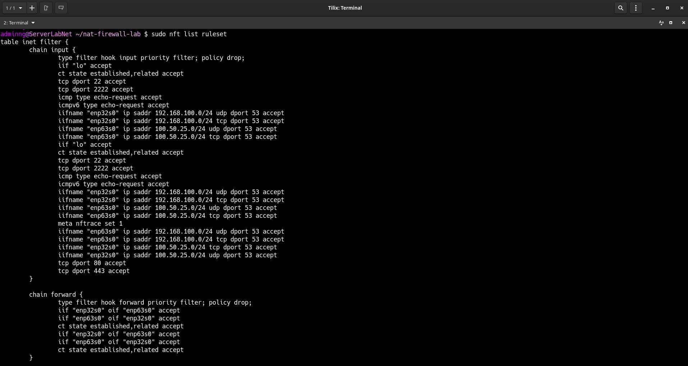
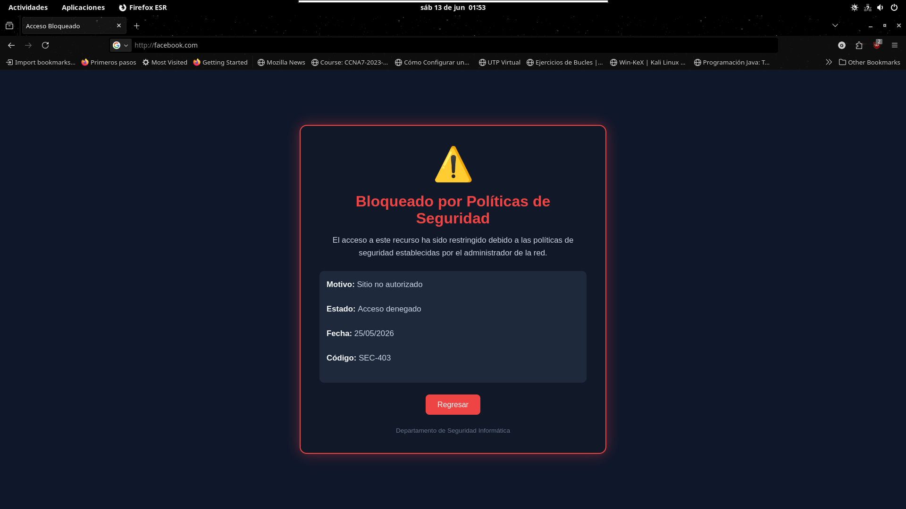
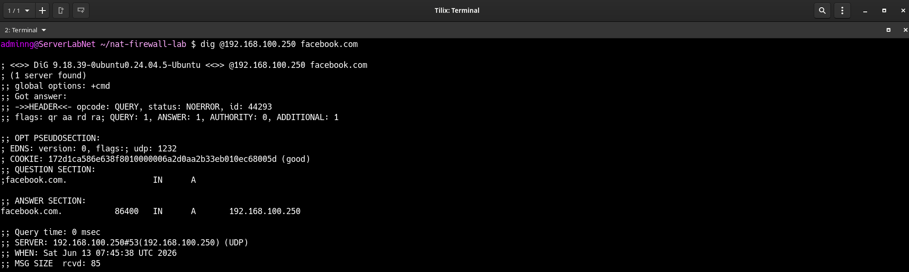
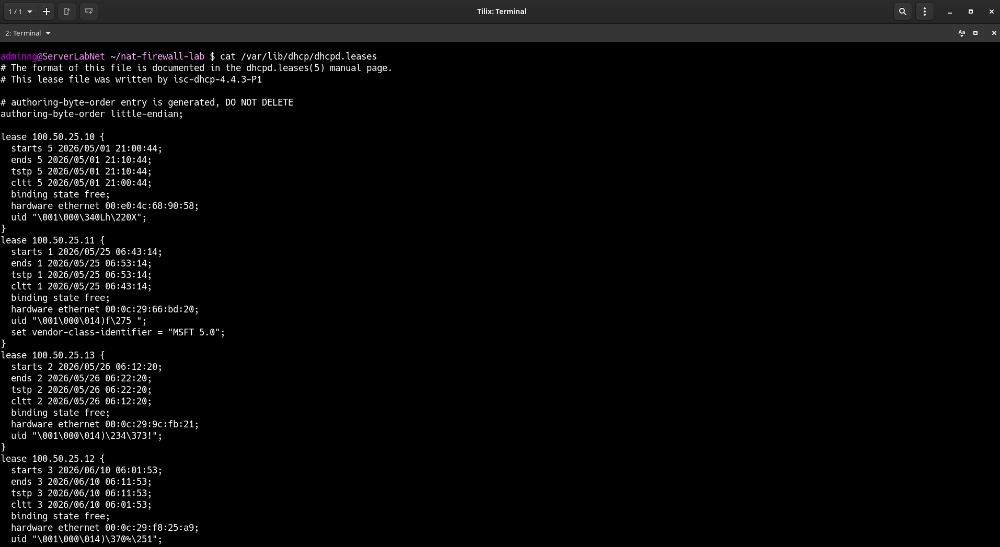

# nat-firewall-lab

Laboratorio de red con firewall, NAT, DNS autoritativo con bloqueo de dominios y DHCP, implementado sobre Linux con nftables, BIND9 e ISC DHCP.

---

## Topología

```
                        Internet
                           │
                    [Router doméstico]
                           │
              192.168.100.0/24 (WAN)
                           │
              ┌────────────┴────────────┐
              │  enp63s0 — 192.168.100.250  │
              │       SERVIDOR              │
              │  enp32s0 — 100.50.25.1      │
              └────────────┬────────────┘
                           │
               100.50.25.0/24 (LAN)
                           │
              ┌────────────┴────────────┐
              │     Clientes del lab    │
              │   100.50.25.10 – .30    │
              └─────────────────────────┘
```

| Interfaz | Rol | Red | IP |
|----------|-----|-----|----|
| enp63s0 | WAN | 192.168.100.0/24 | 192.168.100.250 |
| enp32s0 | LAN | 100.50.25.0/24 | 100.50.25.1 |

---

## Componentes

| Componente | Tecnología | Descripción |
|------------|------------|-------------|
| Firewall + NAT | nftables | Filtrado de paquetes, forwarding y masquerade |
| DNS | BIND9 | Resolución interna y bloqueo de dominios |
| DHCP | ISC DHCP | Asignación de IPs en la red LAN |
| Página de bloqueo | nginx + HTML/CSS | Advertencia visual para dominios bloqueados |

---

## Documentación

- [Firewall y NAT con nftables](docs/nftables.md)
- [DNS con BIND9](docs/dns.md)
- [DHCP con ISC DHCP Server](docs/dhcp.md)
- [Página de advertencia con nginx](docs/nginx.md)

---

## Estructura del repositorio

```
nat-firewall-lab/
├── README.md
├── docs/
│   ├── nftables.md
│   ├── dns.md
│   ├── dhcp.md
│   └── nginx.md
└── configs/
    ├── nftables.conf
    ├── named.conf.options
    ├── named.conf.local
    ├── db.empresa.local
    ├── db.blocked
    └── dhcpd.conf
```

---

## Flujo de bloqueo DNS

```
Cliente → facebook.com
    └─► BIND9 (zona local) → resuelve a 192.168.100.250
            └─► nginx → sirve página de advertencia
```

---

## Requisitos

- Linux (Debian/Ubuntu)
- `nftables`
- `bind9`
- `isc-dhcp-server`
- `nginx`
- IP forwarding habilitado: `net.ipv4.ip_forward = 1`

---

## Problemas encontrados y soluciones

### 1. Reglas duplicadas en nftables
**Problema:** Durante el desarrollo se acumularon reglas duplicadas en las cadenas `input`, `forward` y `nat` producto de ediciones iterativas. No rompían el funcionamiento pero ensuciaban la config y dificultaban la lectura.  
**Solución:** Auditoría manual de cada cadena, identificación de duplicados y reescritura limpia del archivo. Se consolidaron reglas similares usando sets (`tcp dport { 22, 2222 }`).

---

### 2. Interfaces WAN/LAN documentadas al revés
**Problema:** Al describir la topología inicialmente se etiquetaron las interfaces al revés: `enp32s0` como WAN y `enp63s0` como LAN, cuando en realidad es lo contrario según la asignación real de IPs.  
**Solución:** Verificación con `ip -br -c a` para confirmar qué IP tiene cada interfaz y corrección de toda la documentación y configs en consecuencia.

---

### 3. Port forwarding experimental no funcional (puerto 2222)
**Problema:** Se intentó configurar port forwarding desde el router doméstico al servidor (puerto 2222 → `100.50.25.15:22`) para probar acceso externo. La regla DNAT en nftables es correcta, pero el router doméstico no permite configurar redirección de puertos hacia dispositivos de su red.  
**Solución:** La regla se conserva en la config como referencia documentada del intento. Para un escenario real se requeriría acceso a la configuración del router o una VPN (WireGuard).

---

### 4. DNS para clientes LAN apunta a IP de la interfaz WAN
**Problema:** El servidor DHCP entrega `192.168.100.250` como DNS a los clientes de la LAN (`100.50.25.0/24`), siendo esa la IP de la interfaz WAN del servidor. Aparentemente inconsistente.  
**Solución:** Es intencional. BIND9 escucha en `any` (todas las interfaces), por lo que responde tanto por `enp63s0` como por `enp32s0`. Las reglas nftables permiten consultas DNS desde ambas redes y los clientes LAN alcanzan esa IP gracias al forwarding activo.

---

## Evidencias

> Capturas del laboratorio funcionando en producción.

### Reglas nftables activas


### Página de advertencia — dominio bloqueado


### Verificación de bloqueo DNS


### Leases DHCP activos


---

## Autor

**Gustavo Isaias Nava Merino**  
TSU en Infraestructura de Redes Digitales  
Ingeniería en Redes Inteligentes y Ciberseguridad *(cursando)*  
Universidad Tecnológica de Puebla
